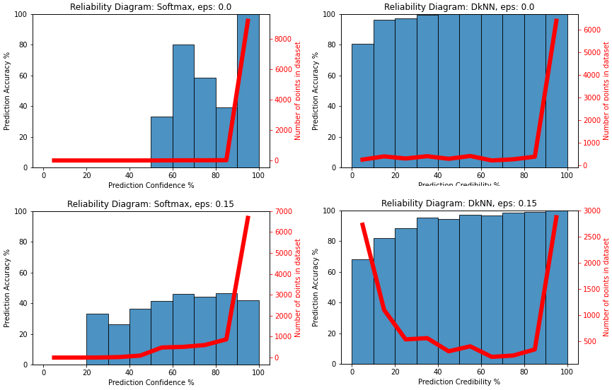

# Deep k-Nearest Neighbour
Experimenting with Deep k-Nearest Neighbour algorithm  ("Deep k-Nearest Neighbors: Towards Confident, Interpretable and Robust Deep Learning" by Nicolas Papernot and Patrick McDaniel[1]). This project contributions:
- improves its performance by testing with various algorithms for finding neighbours.
- proposes a novice approach to enable DkNN to be used with more complex Neural Network's architechtures.
- thorough testing with different levels of disstortions and datasets.

Accuracies of NNs with different approximate nearest neighbours algorithms DkNN and baseline model with respect to the level of distortions:

Reliability diagrams of CNN’s Softmax confidence and DkNN’s credibility:

##### Please read report.pdf for details. 

[1] https://arxiv.org/abs/1803.04765
